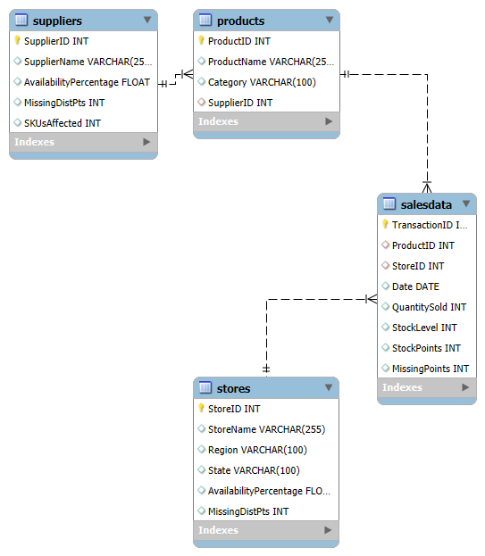

# Product Availability Dashboard

## Overview
The **Product Availability Dashboard** analyzes and visualizes inventory data to identify gaps in product availability across categories, suppliers, days, and store regions. Built using Tableau, MySQL, and fictional datasets, this dashboard offers actionable insights to optimize inventory levels and improve retail performance.

---

## Features
- **Category Analysis**: Availability percentage and missing distribution points by category.
- **Supplier Insights**: SKUs affected and availability performance for each supplier.
- **Regional Performance**: Availability by store region, highlighting problem areas.
- **Daily Trends**: Tracks daily availability percentage and stocking points.
- **Interactive Dashboard**: Filters for date, region, category, and supplier with drill-down functionality.

---

## Schema Design
The database schema includes four main tables:
1. **Suppliers**: Information about suppliers and their metrics.
2. **Products**: Product details, including categories and associated suppliers.
3. **Stores**: Store-level data, including location and availability performance.
4. **SalesData**: Transactional data with stock levels and sales performance.

Refer to the Entity-Relationship Diagram below:



---

## Tools and Technologies
- **MySQL**: For schema creation and data management.
- **Tableau**: For building interactive dashboards and visualizations.
- **ChatGPT**: Used for generating realistic fictional datasets.

---

## Dataset Generation
- **Fictional Data**: Created to simulate retail operations, including categories, suppliers, stores, and sales data.
- **Stratification**: Ensured balanced representation of regions and product categories.

---

## Dashboard Visualization


### Key Components:
1. **Category-Level Analysis**: Highlights gaps in availability by category.
2. **Supplier Analysis**: Tracks SKUs and availability percentage for suppliers.
3. **Regional Analysis**: Visualizes availability across store regions.
4. **Daily Trends**: Shows availability percentage and stocking points over time.

---

## Getting Started
### Prerequisites
- MySQL installed for importing the schema.
- Tableau Desktop for visualizing the dashboard.
- Git installed to clone the repository.

### Steps
1. **Clone the Repository**:
   ```bash
   git clone https://github.com/your-username/Product-Availability-Dashboard.git

